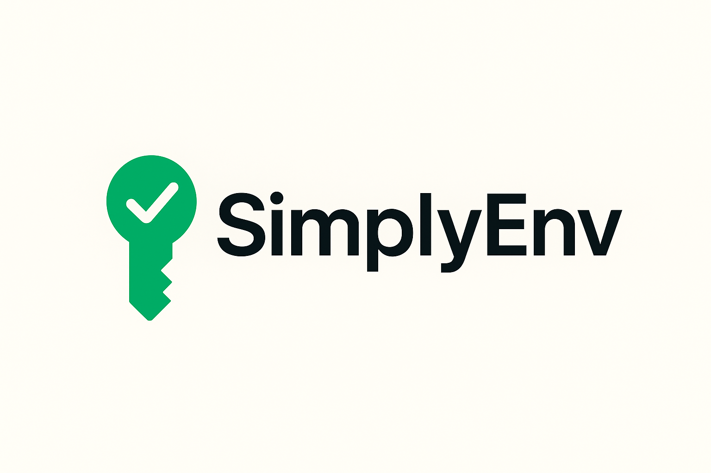

# simplyenv

The developer's environment manager & user-friendly direnv alternative.

`simplyenv` automates project setup by loading directory-specific environment variables when you enter a folder and unsetting them when you leave. Unlike `direnv`, `simplyenv` includes a **modern graphical UI (`simplyenv ui`)**, seamless **bulk import/export**, a **central project catalog**, and intuitive CLI commands.

<p align="center">
  
</p>

---

## Features

- 🖥️ **Modern Web & Desktop Dashboard (`simplyenv ui`)**: Sleek dark-mode interface to inspect, search, add, edit, and delete environment variables with one-click secret masking/revealing.
- ⚡ **Zero-Friction Automatic Shell Switching**: Seamless integration with Bash, Zsh, Fish, and PowerShell that automatically exports variables on `cd` into a directory and cleans them up on exit.
- 📦 **Bulk Imports & Exports**: Import and export variables to and from `.env`, JSON, POSIX Shell `export`, and Docker `ENV` formats.
- 📁 **Central Project Catalog**: Track and manage multiple project directories from a single dashboard even without navigating into them.
- 🧰 **Full-Featured CLI**: Manage variables directly from terminal with `simplyenv set`, `simplyenv unset`, `simplyenv list`, `simplyenv import`, and `simplyenv export`.
- 🚀 **100% Standalone & Portable**: Pure Go with embedded UI assets (`//go:embed`). No runtime dependencies, no external servers required. Works across **Linux, macOS, and Windows**.

---

## Quick Start

### 1. Build from Source
```bash
go build -o simplyenv cmd/simplyenv/main.go
# Optionally move to your PATH:
# sudo mv simplyenv /usr/local/bin/
```

### 2. Launch the Graphical Dashboard
```bash
simplyenv ui
```
Opens the interactive environment manager dashboard in your browser.

### 3. Configure Shell Integration (Automatic Auto-switching)

You can install the shell hook **automatically with a single command**:

```bash
simplyenv install-hook
```
`simplyenv` detects your active shell (`bash`, `zsh`, `fish`, or `pwsh`) and safely appends the hook into your profile (`~/.bashrc`, `~/.zshrc`, etc.) with zero duplicate risk.

Alternatively, you can click **"Shell Hook Setup"** inside the `simplyenv ui` and press **"Install Automatically"**, or manually add the hook line:

#### Bash (`~/.bashrc`)
```bash
eval "$(simplyenv hook bash)"
```

#### Zsh (`~/.zshrc`)
```bash
eval "$(simplyenv hook zsh)"
```

#### Fish (`~/.config/fish/config.fish`)
```fish
simplyenv hook fish | source
```

#### PowerShell (`$PROFILE`)
```powershell
Invoke-Expression (simplyenv hook pwsh)
```

---

## CLI Usage

```bash
# Set or update a variable in current directory
simplyenv set API_KEY="sk_live_123456"

# List all variables for current or target directory
simplyenv list
simplyenv list /path/to/other/project

# Remove a variable
simplyenv unset API_KEY

# Bulk import from a file
simplyenv import .env.production

# Bulk export
simplyenv export --format json
simplyenv export --format shell
simplyenv export --format docker

# Launch UI on a specific port
simplyenv ui --port 9000
```
